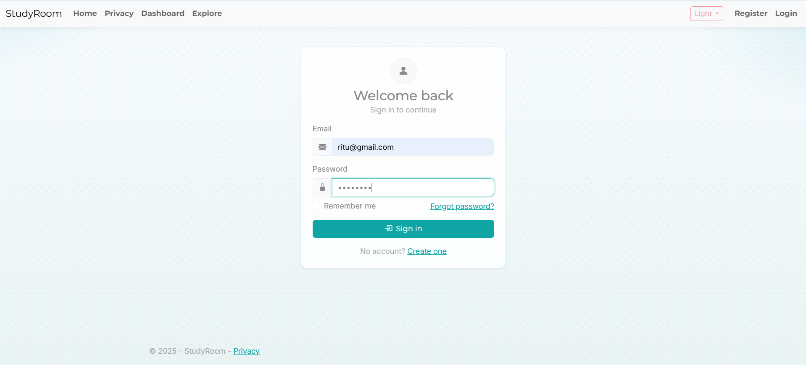
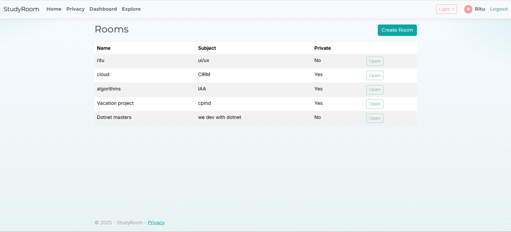
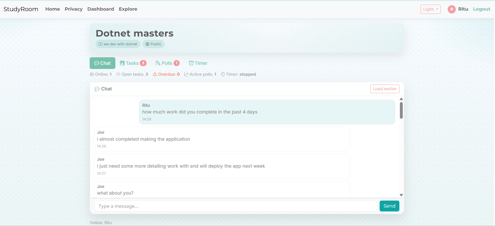
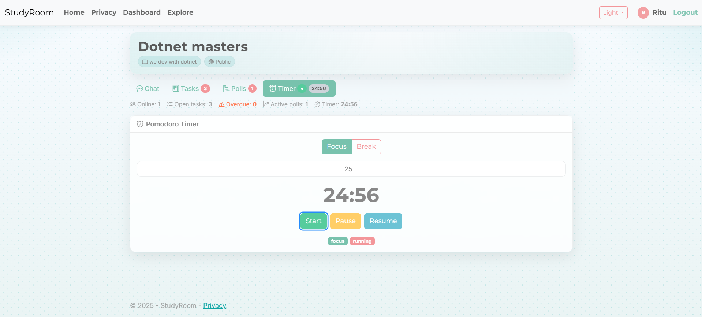
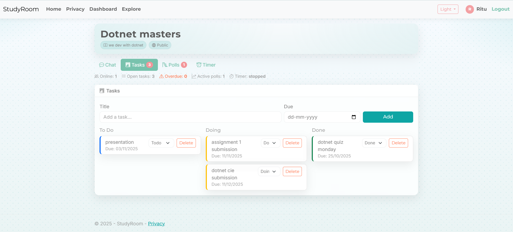
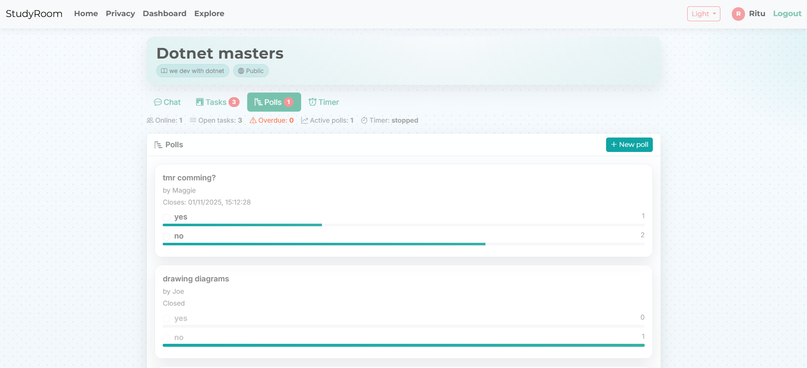
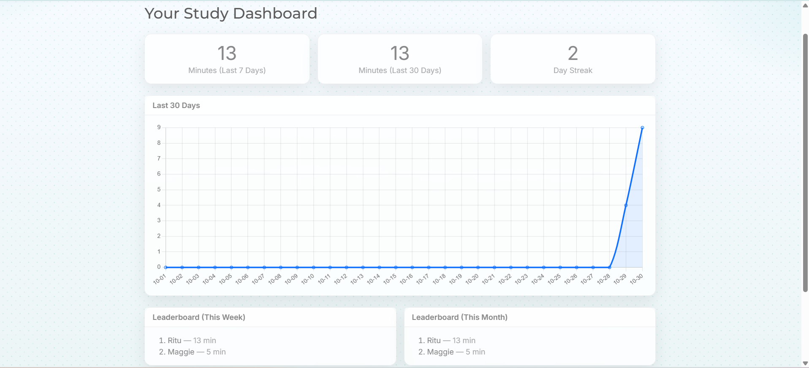
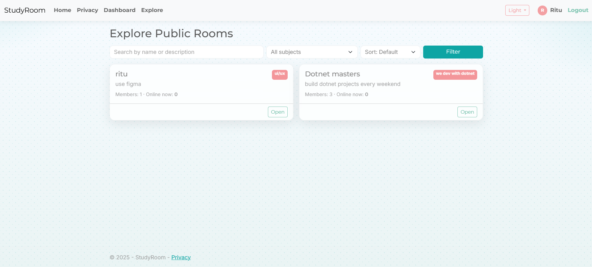
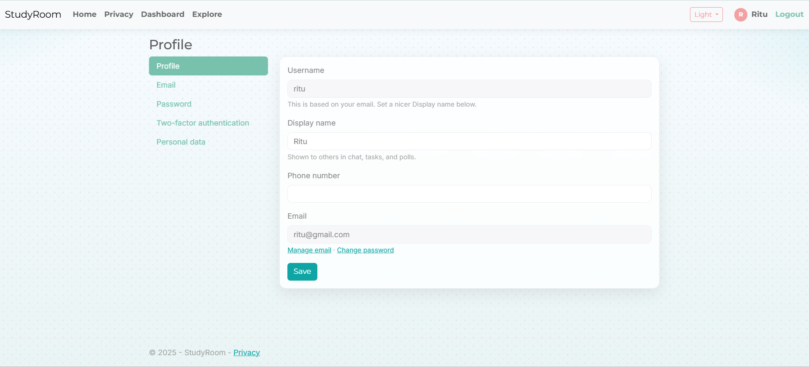

# 🎓 StudyRoom (ASP.NET Core MVC + SignalR)

> A **real-time virtual study room platform** that helps students stay focused together. It features **live chat**, a **shared Pomodoro timer**, **tasks**, **polls**, **dashboards**, **dark mode**, and **private room access** using join codes.

---

## 📝 Description

**StudyRoom** is a collaborative platform where students can create or join study rooms, interact in real time, and track their study progress.
Each room includes live chat, a synchronized Pomodoro timer, personal task boards, and achievements — making studying productive, social, and fun.

This project demonstrates **ASP.NET Core MVC** with **SignalR** for real-time communication and **Entity Framework Core** for database management.

---

## ✨ Features

### 🔐 Authentication

* Secure login, registration, and logout via ASP.NET Identity
* User profiles include Display Name and Goals

### 🏠 Study Rooms

* Create **public** or **private** rooms
* Join private rooms using a **unique Join Code**
* Browse public rooms with filters and live member counts

### ⚡ Real-time Collaboration (SignalR)

* Live group chat with presence updates
* Shared Pomodoro timer synchronized across all users
* Real-time updates for tasks, polls, and chat

### ✅ Taskboard

* Add and manage personal tasks
* Columns: *To Do*, *Doing*, *Done*
* Changes reflect instantly across connected users

### 📊 Polls

* Create polls with multiple options
* Vote instantly and see live results

### 🏅 Dashboard & Achievements

* View study progress and streaks
* Earn badges like *Early Bird*, *Focus Master*, and *Consistency Star*

### 🎨 UI/UX

* Clean, responsive design with **Dark Mode** (auto/light/dark)
* Toast notifications for joins, messages, and achievements
* Organized card-style layout for better readability

---

## 💻 Technology Stack

| Layer              | Technology                     |
| ------------------ | ------------------------------ |
| **Backend**        | ASP.NET Core 8 MVC             |
| **Realtime**       | SignalR                        |
| **Frontend**       | Bootstrap 5.3, Bootstrap Icons |
| **Authentication** | ASP.NET Identity               |
| **Database**       | Entity Framework Core (SQLite) |
| **Language**       | C#, Razor Views, JavaScript    |

---

## 🖼️ Screenshots

### 🔐 Login Page



### 🏠 Rooms Page



### 💬 Chat Window



### ⏱️ Pomodoro Timer



### 🧾 Taskboard



### 📊 Polls



### 🏅 Dashboard



### 🌍 Explore Rooms



### 👤 Profile Page



---

## ⚙️ Prerequisites

* [.NET 8 SDK](https://dotnet.microsoft.com/en-us/download)
* [Git](https://git-scm.com/)

---

## 🚀 Getting Started

### 1. Clone the Repository

```bash
git clone https://github.com/your-username/StudyRoom.git
cd StudyRoom
```

### 2. Restore Dependencies

```bash
dotnet restore
```

### 3. Apply Database Migrations

```bash
dotnet ef database update
```

### 4. Run the Project

```bash
dotnet run --urls http://localhost:5151
```

Then open:
👉 [http://localhost:5151/Rooms](http://localhost:5151/Rooms)

---

## ⚙️ Configuration

### Ports

* Default: `http://localhost:5151`
* Modify in `launchSettings.json` or via `UseUrls()` in `Program.cs`

### Database

* Uses **SQLite (`app.db`)** for development
* Create new migrations:

  ```bash
  dotnet ef migrations add <MigrationName> -o Data/Migrations
  dotnet ef database update
  ```

### Seeding

* Default badges are auto-seeded via `SeedData.EnsureBadges(db)`
* Can extend to seed demo users, rooms, and messages

---

## 🌙 Dark Mode

* Stored in browser `localStorage` (`theme = auto | light | dark`)
* Integrated with Bootstrap 5.3’s color modes
* Automatically adapts to user system preferences

---

## ⚡ Real-time Communication (SignalR)

### ChatHub → `/hubs/chat`

Handles joining/leaving rooms, sending messages, and updating online user lists.

### TimerHub → `/hubs/timer`

Manages synchronized Pomodoro timers — start, pause, and resume actions for all participants.

---

## 🧠 Data Model Overview

| Entity                | Description                                               |
| --------------------- | --------------------------------------------------------- |
| **ApplicationUser**   | Stores user info (DisplayName, Goals, Avatar)             |
| **Room**              | Represents a study room (Public/Private, JoinCode, Owner) |
| **RoomMember**        | Connects users with rooms and roles                       |
| **Message**           | Stores chat messages with timestamps                      |
| **StudySession**      | Records Pomodoro focus sessions                           |
| **Badge / UserBadge** | Tracks earned badges and awards                           |

---

## 🛣️ Roadmap

* Typing indicator in chat
* Unread message counters
* Drag-and-drop Taskboard
* File/image sharing in chat
* Personal timer mode
* Email reminders and weekly reports
* Cloud deployment (Azure, Render, or Railway)

---

## 📄 License

MIT (or your preferred license). Add a LICENSE file if needed.
